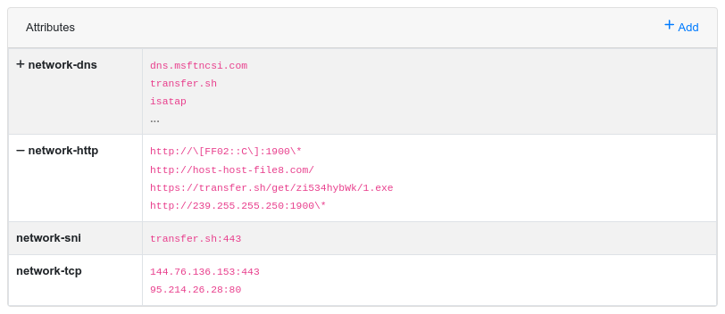

# karton-pcap-miner

Extract network indicators from analysis PCAPs and add push them to MWDB as attributes.



*Example analysis results in MWDB*

## Prerequisites

* tshark (`apt install tshark`)
* karton-core

## Built-in analyzers

 * **http**
   * contacted http(s) URLs, example: `http://305friend.caesarsgroup.top/_errorpages/305friend/five/fre.php`
 * **tcp**
   * contacted tcp hosts (including destination port), example: `104.21.1.61:80`
 * **sni**
   * server names extracted from TLS handshakes (including destination port), example: `305friend.caesarsgroup.top:443`
 * **dns**
   * DNS queries, example: `305friend.caesarsgroup.top`

## Configuration

The default configuration uses the following configuration. You should modify it to suit your own instance if you're deploying the services on your own infrastructure.

```ini
[pcap-miner]
vm_ip_range=10.0.0.0/8
max_results=24
ignore_list=
```

Read the [karton documentation](https://karton-core.readthedocs.io/en/latest/service_configuration.html) to learn how to configure services in your own deployment.

### VM IP range

Set the `vm_ip_range` value to specify the range of IP addresses used by VMs. This is used to detect the outgoing direction in network connections.


### Max results

Some samples may purposely generate a huge number of TCP/DNS connections. The `max_results` configures the maximum number of results reported for a given analyzer. If The number exceeds the configured value, no values are reported at all. Set to `-1` to always report all results.

### Max PCAP size

Processing huge (>100MB) PCAP files can change a considerable amount of time. Use the `max_pcap_size` option to specify the maximum PCAP file size to be analyzed (in bytes).

### Indicator ignorelist

In some cases you don't really want to report some of the indicators that come up in almost all PCAPs. Things like OCSP, UPNP, telemetry appears very frequently and doesn't provide any analytic value per se.

You can configure the ignored values for each analyzer using the `ignore_list` configuration value. It should point to a JSON file containing the excluded values:

```json
{
    "network-http": ["http://239.255.255.250:1900*","http://[FF02::C]:1900*"],
    "network-tcp": [],
    "network-sni": ["google.com:443"],
    "network-dns": ["teredo.ipv6.microsoft.com","isatap","dns.msftncsi.com","wpad"]
}
```
